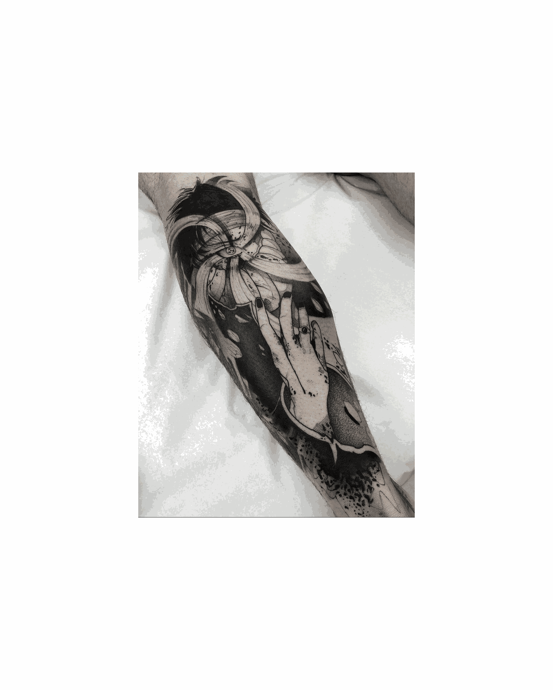
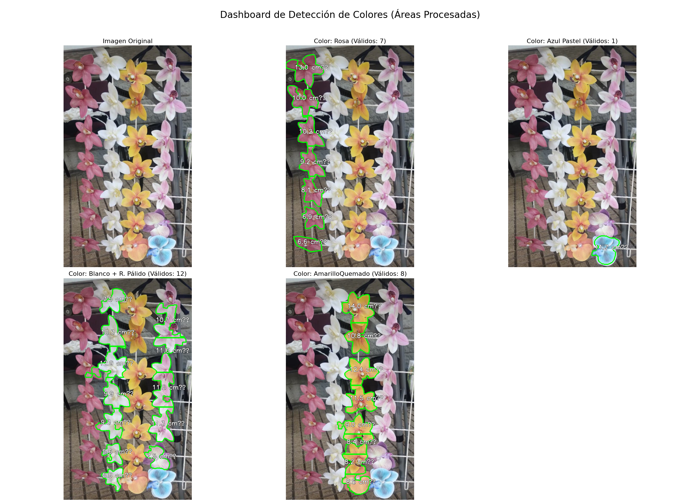

# Tabajo 1

## Calibración de la camara

Para la calibración de la cámara se siguió la guia de GeeksforGeeks (s.f.), con el cual se obtuvieron los siguientes resultados.

La función cv2.drawChessboardCorners() desempeña un papel crucial al visualizar y verificar el éxito de la detección de esquinas en la imagen, asegurando la calidad de los puntos de referencia. Se empleó la siguiente línea de código para la visualización:

```python
# Dibujar y mostrar las esquinas en la imagen
image = cv2.drawChessboardCorners(image, 
                                  CHECKERBOARD, 
                                  corners2, ret)
```
En la Figura 1 se muestran cuatro de las imágenes utilizadas con las esquinas detectadas. Esta detección es esencial, ya que estos puntos proporcionan las coordenadas de referencia precisas necesarias para el algoritmo de calibración de la cámara.

<table>
  <caption>
    <strong>Figura 1:</strong> Tableros de ajedrez con las esquinas detectadas.
  </caption>
  <tr>
    <td style="text-align: center;">
      
      <p><strong>Figura 1.a</strong></p>
    </td>
    <td style="text-align: center;">
      
      <p><strong>Figura 1.b</strong> </p>
    </td>
  </tr>
  <tr>
    <td style="text-align: center;">
      
      <p><strong>Figura 1.c</strong></p>
    </td>
    <td style="text-align: center;">
      
      <p><strong>Figura 1.d</strong> </p>
    </td>
  </tr>
</table>

El objetivo principal de la calibración es obtener la estimación de los parámetros que transforman una coordenada del mundo real (3D) en una coordenada de píxel en la imagen (2D). Para ello, se determinaron la matriz intrínseca de la cámara y los coeficientes de distorsión.

**Ecuación 1:** Matriz Intrínseca de la Cámara ($\mathbf{K}$)

$$
\mathbf{K} = \begin{bmatrix}
1.344 \times 10^{3} & 0.0 & 801.86 \\
0.0 & 1.351 \times 10^{3} & 613.08 \\
0.0 & 0.0 & 1.0
\end{bmatrix}
$$

De la Ecuación 1 se obtine la  observar la Matriz Intrínseca de la cámara que esta compuesta por las longitudes focales $f_x$ y $f_y$, y las cordenadas $c_x$ y $c_y$ del centro óptico.  
Se observar que $f_x \approx 1344.23 \text{ píxeles}$ y $f_y \approx 1350.77 \text{ píxeles}$, la diferencia  aproximadamente 6.5 píxeles entre los ejes focales representa menos del $1\%$ del valor total, lo que confirma que la camara utiliza píxeles cuadrados, si esta diferencia resulta ser significativamente mayor ya estariamos hablando de píxeles rectangulares o que hay un problema, ya sea de aliasing (píxeles de un sensor es demasiado grande en comparación con los detalles finos de la escena) o escalado en la lectura del sensor. Respecto al centro óptico, los puntos $c_x = 801.86 \text{ píxeles}$ y $c_y = 613.08 \text{ píxeles}$ se encuentran muy próximos al centro geométrico teórico de la imagen $(800.0, 600.0)$. El desplazamiento es mínimo, siendo de $1.86 \text{ píxeles}$ en $x$ y $13.08 \text{ píxeles}$ en $y$.

$$\text{Error RMS Total} = \frac{1}{N} \sum_{i=1}^{N} \left( \frac{1}{M_{i}} \sum_{j=1}^{M_{i}} \left\| \mathbf{m}_{i, j} - \mathbf{\hat{m}}_{i, j} \right\| \right)$$

Caption 1. Fórmula utilizada para calcular el Error RMS Total de Reproyección. $N$ es el número total de imágenes; $M_i$ es el número de puntos detectados en la imagen $i$; $\mathbf{m}_{i, j}$ es la coordenada 2D real (observada) del punto; y $\mathbf{\hat{m}}_{i, j}$ es la coordenada 2D predicha (reproyectada) por el modelo de la cámara.

El RMS obtenido fue de $0.495 \text{ píxeles}$, que es menor al umbral de $0.5 \text{ píxeles}$. Esto quiere decir que la ubicación real de las esquinas en la imagen y la ubicación predicha por el modelo matemático de la cámara difieren en menos de medio píxel.

**Ecuación 2:** Vector de Coeficientes de Distorsión ($\mathbf{D}$)

$$
\mathbf{D} = \begin{pmatrix}
2.771 \times 10^{-1} & -1.895 & -7.036 \times 10^{-5} & 5.678 \times 10^{-4} & 4.138
\end{pmatrix}
$$

En la Ecuación 2 se obtienen los coheficinetes de distorción $k_1 = 0.277$ de primer orden, $k_2 = -1.895 $, $p_1 = -7.036 \times 10^{-5 } $ de segundo orden y $k_3 = 4.138$ de tercer orden. Cuando $k_1$ es negativo predomina la distorcion barril (las lineas se curvan hacia afuera), pero cuando $k_1$ es positivo se espera tener una distorsion cojin (las lineas se curvan hacia adentro). Como el coeficiente $k_1 > 0$ se espera que las imagenes muestren una distorsion cojin. 

Respecto a los coeficientes de distorsión, se observa lo siguiente:

- Coeficiente $k_2$: Al ser un valor negativo, $k_2$ está actuando como un compensador o corrector para mitigar el efecto de una potencial subcorrección (o sobrecorrección) generada por $k_1$.

- Coeficiente $k_3$: El valor de $k_3$ es significativamente grande. Esto indica que la distorsión de la lente es compleja o fuerte, lo que sugiere que el modelo de calibración no logró un ajuste preciso de la distorsión utilizando únicamente los coeficientes $k_1$ y $k_2$.

Los parámetros $p_1$ y $p_2$ miden la distorsión tangencial, la cual provoca que un punto en el mundo real se proyecte en la imagen con un pequeño desplazamiento asimétrico a lo largo de un vector que no es puramente radial.

Los valores obtenidos son: $p_1 = -7.036 \times 10^{-5}$ y $p_2 = 5.678 \times 10^{-4}$.

Al ser valores tan pequeños, esto demuestra una alineación física casi perfecta entre el eje óptico de la lente y el sensor de la cámara, un factor ideal para la visión artificial de precisión.

<h4>Figura 2: Comparación de Imágenes (Original vs. Corregida)</h4>
<div style="display: grid; grid-template-columns: 50% 50%; gap: 10px;">
    
<!-- PAR 1 -->
<div style="text-align: center;">
    
    <p><strong>(a.1) Original</strong></p>
</div>
<div style="text-align: center;">
    
    <p><strong>(b.1) Corregida</strong></p>
</div>

<!-- PAR 2 -->
<div style="text-align: center;">
    
    <p><strong>(a.2) Original</strong></p>
</div>
<div style="text-align: center;">
    
    <p><strong>(b.2) Corregida</strong></p>
</div>

<!-- PAR 3 -->
<div style="text-align: center;">
    
    <p><strong>(a.3) Original</strong></p>
</div>
<div style="text-align: center;">
    
    <p><strong>(b.3) Corregida</strong></p>
</div>
</div>

La corrección de la distorsión radial se evaluó con especial atención en las esquinas, ya que esta distorsión aumenta proporcionalmente con la distancia al centro óptico $(𝑟)$, lo que hace que dicha zona requiera el mayor desplazamiento de píxeles. Visualmente, la Figura 2 confirma el éxito, mostrando que las líneas del tablero, que en la imagen original se curvaban hacia el interior (distorsión de tipo cojín), ahora son segmentos perfectamente rectos y paralelos, incluso en los bordes extremos. Esta corrección robusta está respaldada por el bajo error RMS de reproyección $(0.495 px)$, lo que indica que la predicción de la posición de cada punto, incluidos los de las esquinas, se logró con una precisión subpíxel.


## 3. Implementar y aplicar transformaciones de rotación y traslación


Creen una función que:

* **Cargue una imagen**
* **Aplique 5-8 transformaciones sucesivas** (traslaciones, rotaciones, escalas)
* **Genere un GIF animado o video** mostrando la secuencia
* **Guarden cada frame intermedio**


---
### Contexto

En el **procesamiento digital de imágenes**, las **transformaciones geométricas** son operaciones que permiten modificar la posición, orientación o tamaño de los objetos dentro de una imagen. Entre las más comunes se encuentran la **traslación**, la **rotación** y la **escala**.

Estas operaciones son fundamentales en áreas como **visión por computador**, **gráficos por computadora** y **robótica**, donde es necesario manipular imágenes para análisis, reconstrucción o animación.

El objetivo de este ejercicio es implementar un programa en **Python** que cargue una imagen, aplique una serie de transformaciones geométricas sucesivas y genere un **GIF animado** que muestre la secuencia de transformaciones aplicadas.

---

### Fundamento Teórico


Las transformaciones geométricas son operaciones fundamentales en el **procesamiento digital de imágenes**, ya que permiten modificar la posición, orientación o tamaño de los objetos dentro de una escena.

### a. Traslación:

Desplaza una imagen una distancia $(t_x, t_y)$ sobre los ejes $X$ y $Y$:

$$x' = x + t_x, \quad y' = y + t_y$$

### b. Rotación:

Gira la imagen un ángulo $\theta$ respecto a un punto de referencia:

$$\begin{bmatrix} x' \\ y' \end{bmatrix} = \begin{bmatrix} \cos(\theta) & -\sin(\theta) \\ \sin(\theta) & \cos(\theta) \end{bmatrix} \begin{bmatrix} x \\ y \end{bmatrix}$$

### c. Escalamento:

Aumenta o reduce el tamaño de una imagen según un factor $s$:

$$x' = s_x \cdot x, \quad y' = s_y \cdot y$$

Combinadas, estas operaciones permiten realizar **transformaciones afines** que preservan las líneas y proporciones de la imagen original.


### Metodología

1. **Carga de la imagen original:**  
   Se utilizó la librería `PIL` para abrir y convertir la imagen a formato RGBA, garantizando compatibilidad con transparencia.

2. **Definición de transformaciones:**  
   Se definió una lista de diccionarios con los parámetros de **rotación (rot)**, **traslación (tx, ty)** y **escala (scale)** para cada paso sucesivo.

3. **Aplicación secuencial:**  
   Para cada transformación:
   - Se reescaló la imagen.
   - Se rotó según el ángulo indicado.
   - Se pegó sobre un fondo blanco, ajustando la posición con traslación.

4. **Generación de frames:**  
   Cada imagen transformada se guardó como `frame_XX.png` en la carpeta `frames_temp/`.

5. **Creación del GIF:**  
   Finalmente, con `imageio.mimsave()` se combinan los cuadros en un GIF animado llamado **`transformaciones.gif`**.

---

### Código Implementado

El siguiente script en Python aplica **transformaciones geométricas** (rotación, traslación y escalamiento) a una imagen para generar un **GIF animado**.  
Además, incluye una verificación para evitar volver a ejecutar la función si los resultados ya existen.

---

### 🧩 Código fuente

```python
def transformar_imagen(ruta_imagen, salida_gif="animacion.gif"):
    carpeta_frames = "frames_temp"

    #  Si ya existen los resultados, no ejecutar la función
    if os.path.exists(carpeta_frames) and os.path.exists(salida_gif):
        print("Las carpetas y el GIF ya existen. No se ejecutará la función.")
        return

    # Crear carpeta temporal para los frames (solo si no existe)
    os.makedirs(carpeta_frames, exist_ok=True)

    # Cargar imagen original
    img_original = Image.open(ruta_imagen).convert("RGBA")
    ancho, alto = img_original.size

    # Lista para guardar los frames
    frames = []

    # Definir transformaciones (rotación, traslación, escala)
    transformaciones = [
        {"rot": 0,   "tx": 0,  "ty": 0,  "scale": 1.0},
        {"rot": 15,  "tx": 20, "ty": 0,  "scale": 1.1},
        {"rot": 30,  "tx": 40, "ty": 10, "scale": 1.2},
        {"rot": 60,  "tx": 60, "ty": 20, "scale": 1.1},
        {"rot": 90,  "tx": 80, "ty": 40, "scale": 0.9},
        {"rot": 120, "tx": 60, "ty": 60, "scale": 0.8},
        {"rot": 150, "tx": 40, "ty": 80, "scale": 0.9},
        {"rot": 180, "tx": 0,  "ty": 100,"scale": 1.0},
    ]

    for i, t in enumerate(transformaciones):
        # Aplicar escala
        nuevo_ancho = int(ancho * t["scale"])
        nuevo_alto = int(alto * t["scale"])
        img_transformada = img_original.resize((nuevo_ancho, nuevo_alto))

        # Aplicar rotación
        img_transformada = img_transformada.rotate(t["rot"], expand=True)

        # Crear fondo blanco
        fondo = Image.new("RGBA", (ancho * 2, alto * 2), (255, 255, 255, 255))

        # Calcular posición
        x = ancho // 2 + t["tx"]
        y = alto // 2 + t["ty"]

        # Pegar imagen transformada
        fondo.paste(img_transformada, (x, y), img_transformada)

        # Guardar frame
        frame_path = os.path.join(carpeta_frames, f"frame_{i:02d}.png")
        fondo.save(frame_path)
        frames.append(imageio.v3.imread(frame_path))

    # Crear GIF con loop infinito
    imageio.mimsave(salida_gif, frames, duration=0.5, loop=0)

    print(f" GIF generado correctamente: {salida_gif}")
    print(f" Frames guardados en: {os.path.abspath(carpeta_frames)}")

# Ejemplo de uso 
# Primer parametro : Direccion de la imagen (Utilizaremos la imagen guardada en la carpeta images llamada 'Imagen_gif.jpeg' para utilzar otra simplemente cambiar la ruta)
# Segundo parametro : Como se llamara el gif (Importante poner .gif al final)
transformar_imagen("../images/Imagen_gif.jpeg", "transformaciones.gif")

```

---

### **Resultados**



- Se generó correctamente el archivo **`transformaciones.gif`**, mostrando la secuencia de transformaciones aplicadas sobre la imagen original.  
- Los frames intermedios fueron almacenados en la carpeta **`frames_temp`**, permitiendo su inspección individual.
- El movimiento obtenido refleja un cambio progresivo en posición, tamaño y orientación de la figura, generando una animación fluida y continua.

**Archivos generados:**
```
frames_temp/frame_00.png
frames_temp/frame_01.png
...
frames_temp/frame_07.png
transformaciones.gif
```

---

### **Análisis**

El resultado demuestra la correcta aplicación de transformaciones afines en el plano bidimensional.  
Al combinar **rotación**, **traslación** y **escala**, se observa un efecto dinámico que simula movimiento.  
Además, la función implementa un mecanismo de **control de ejecución** que evita repetir cálculos si los archivos ya existen, optimizando el flujo de trabajo.

**Aspectos destacados:**
- El uso de `expand=True` en la rotación evita recortes de la imagen.  
- La creación de un lienzo de fondo mayor garantiza que la imagen transformada siempre se mantenga visible.  
- El GIF permite visualizar la evolución progresiva de la imagen, siendo útil para comprender los efectos de cada transformación.


## 5. Implementar técnicas fundamentales de segmentación de imágenes.
Capturen una escena con objetos de colores distintos de la Universidad Nacional o de la oficina de alguno de los integrantes del equipo. Debe ser con una cámara de un teléfono celular.
- Segmenten cada objeto por su color
- Cuenten cuántos objetos de cada color hay
- Calculen el área de cada objeto


### Solución

Para analizar una fotografía de orquídeas capturada en la Universidad Nacional con un teléfono Motorola G30, se diseñó un pipeline de visión por computadora con el fin de superar el principal desafío de la escena: el solapamiento y la oclusión entre las flores.

**1. Segmentación de Objetos por Color**

El proceso inicia con la segmentación por color, convirtiendo la imagen al espacio **HSV** para robustez ante variaciones de luz. Se definieron categorías de color ('Rosa', 'Azul Pastel', 'Amarillo Quemado') y una clase especial ('Blancas') que agrupa los tonos blanco y rosa pálido mediante una operación lógica `cv2.bitwise_or`. Los rangos de color se establecieron con un método híbrido: se tomaron valores base de la plataforma HTML Color Codes (2025) y se ajustaron empíricamente analizando la fotografía original.

**2. Conteo de Objetos**

Una vez aislados los objetos, se utilizó el algoritmo `cv2.findContours` para detectar cada elemento individual. Sin embargo, para garantizar un conteo preciso, se implementó una lógica de refinamiento que:
* **Fusiona contornos:** Une fragmentos que pertenecen a un solo objeto pero que fueron detectados por separado.
* **Divide contornos:** Separa objetos que se tocan y fueron erróneamente detectados como uno solo.

Este proceso de post-procesamiento asegura que el número final de objetos contados por color sea una representación fiel de la escena real.

**3. Cálculo del Área de Cada Objeto**

Finalmente para que las mediciones tuvieran validez en el mundo real, se implementó un sistema de calibración de escala. Se tomó como referencia el diámetro promedio de una flor de orquídea, establecido en 10 cm según la literatura consultada (Jardín Botánico de Medellín, 2024). El script mide este diámetro de referencia en píxeles y calcula un factor de conversión **(píxeles por centímetro)**. Finalmente, el área de cada objeto detectado, inicialmente calculada en píxeles con `cv2.contourArea()`, se convierte a **centímetros cuadrados (cm²)** utilizando esta escala.



### Análisis de Resultados
***

En esta sección se evalúa el rendimiento del pipeline de visión por computadora implementado, comparando los resultados cuantitativos obtenidos por el script con una inspección manual de la imagen (Ground Truth). El objetivo es identificar tanto los aciertos como las limitaciones del modelo y proponer mejoras técnicas.

#### Comparativa de Resultados: Predicción vs. Realidad

| Categoría de Color | Cantidad Real (Ground Truth) | Cantidad Predicha (Modelo) | Precisión |
| :----------------- | :--------------------------: | :------------------------: | :-------: |
| Rosa               |              7               |             7              |  100%     |
| Amarillo Quemado   |              7               |             8              |  87.5%    |
| Azul Pastel        |              1               |             1              |  100%     |
| Blanco             |              13              |             12             |  92.3%    |
| **Total** |            **28** |           **28** |  **96.4%**|

*Nota: La precisión se calcula como (Predichos Correctos / Total Real). Para el caso del Amarillo, 7 de 8 detecciones correspondían a flores reales.*

***
#### Discusión de Aciertos y Desafíos

El modelo demostró un alto rendimiento general, con una precisión global del 96.4% en la identificación y conteo de objetos.

**Aciertos Notables:**

* Las categorías **Rosa** y **Azul Pastel** fueron identificadas con un 100% de precisión. Esto valida que los rangos HSV definidos y la lógica de segmentación son altamente efectivos para objetos con colores bien definidos y formas consistentes.

**Desafíos y Puntos de Mejora:**

* **Flores Amarillas (Sobre-segmentación):** El modelo predijo 8 flores cuando en realidad había 7. El análisis cualitativo revela que una única flor fue segmentada incorrectamente en dos partes, resultando en un conteo adicional. Este error de **sobre-segmentación** probablemente se deba a sombras pronunciadas o gradientes de color internos en la flor, que la lógica de división interpretó erróneamente como el límite entre dos objetos.

* **Flores Blancas (Sub-segmentación y Detección de Bordes):** Se predijeron 12 flores de las 13 existentes. El error se originó en la dificultad del modelo para definir correctamente los bordes de dos flores que presentaban una transición de color compleja (de blanco marfil oscuro a rosa pálido). Esto causó que una de las flores no fuera detectada en su totalidad, llevando a un error de **sub-segmentación**. La categoría 'Blancas', al combinar dos rangos de color, es inherentemente más compleja y sensible a estas variaciones sutiles.

***
#### Mejoras Futuras Propuestas

1.  **Refinar la Lógica de Fusión/División:** La división basada en el rectángulo delimitador es efectiva pero simple. Para evitar la sobre-segmentación (caso amarillo), se podría implementar el **Algoritmo de Watershed**. Esta técnica es más robusta para separar objetos que se tocan, ya que se basa en la "topografía" de la imagen en lugar de su geometría simple.

2.  **Mejorar la Segmentación de Colores Complejos:** Para el caso de las flores blancas, en lugar de combinar dos rangas con un `OR` lógico, se podría explorar el uso de técnicas de **clustering de color (como K-Means)** en regiones de interés. Esto permitiría agrupar píxeles de manera más inteligente, adaptándose mejor a las transiciones de tono.

3.  **Pre-procesamiento Adicional:** Aplicar un filtro de suavizado, como un **desenfoque gaussiano (Gaussian Blur)** de bajo nivel antes de la segmentación, podría ayudar a homogeneizar las superficies de las flores. Esto reduciría el impacto de texturas y sombras internas, minimizando el riesgo de errores como el ocurrido con la flor amarilla.


## Referencias
GeeksforGeeks. (s.f.). *Camera Calibration with Python OpenCV*. https://www.geeksforgeeks.org/python/camera-calibration-with-python-opencv/

Reolink. (s.f.). Barrel Distortion: What It Is, and How to Fix It. Reolink Blog. https://reolink.com/blog/barrel-distortion/

OpenCV Development Team. (s.f.). Camera Calibration and 3D Reconstruction. Obtenido de la documentación oficial de OpenCV, módulo calib3d.

Szeliski, R. (2021). Computer Vision: Algorithms and Applications (2.ª ed.). Springer.

HTML Color Codes. (2025). HTML Color Codes. Recuperado el 19 de octubre de 2025, de https://htmlcolorcodes.com/es/

Jardín Botánico de Medellín. (2024). *Ficha técnica: Phalaenopsis amabilis*. Recuperado de https://www.jardinbotanicomedellin.org/orquideas/phalaenopsis


Gonzalez, R. C., & Woods, R. E. (2018). *Digital Image Processing (4th Edition)*. Pearson.  
Pillow Documentation: [https://pillow.readthedocs.io](https://pillow.readthedocs.io)  
ImageIO Documentation: [https://imageio.readthedocs.io](https://imageio.readthedocs.io)